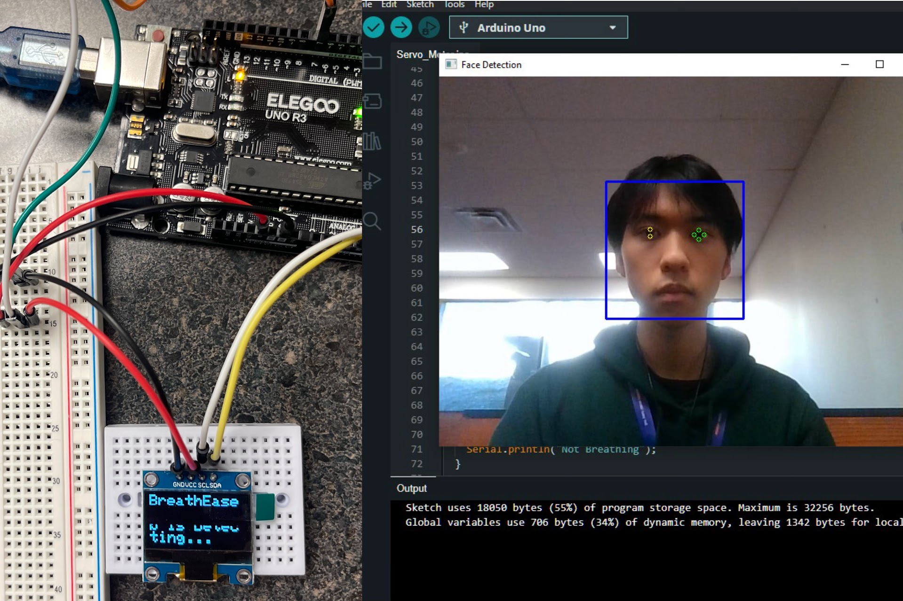

# BreathEase Control Hub

## Inspiration

When I was a kid, my uncle was diagnosed with amyotrophic lateral sclerosis (ALS), a disease involving muscle weakness and atrophy caused by neuronal damage. ALS has had a devastating impact on him and his family. Since then, I have always hoped to assist patients with ALS by building medical devices.

There are various hardware and software in the market that also aim to improve the life experience of disability, especially for ALS patients, However, they are also quite expensive. Fortunately, as the technologies fly in development and manufacture, it is possible to reproduce some of the functionality using a simple laptop and electronics by ourselves.

Hence, I take the opportunity at Hack Western to take the first step in achieving my goal.

## What It Does

BreathEase ControlHub had two main functionalities, including head & eyeball control and breath management. Head & eyeball control enables patients to control their laptops without any other body other than their heads and eyes. It also allows eye blinking as a function of mouse clicking. At the same time, the head detection measurement enables BreathEase ControlHub to determine if the patient is staying in the right place. Breath management will constantly detect breathing through a humidity and temperature sensor. If the data measured is significantly off from the expected values, a warning will be displayed on its screen. All the warnings will be shown on its built-in mini-screen for the facilitation of families and medical teams.

## How We Built It

The facilitation of families and medical patients was mainly implemented by Python and C++ for computer vision and data transmission. The Python package of OpenCV includes the most necessary functions and models, allowing both detection, eye tracking, and serial device connection. On the other hand, the computer hardware (camera) and Arduino with various sensors and connections worked as a root to perform the functionalities written with software.

## Challenges

There were a few challenges that acted as obstacles in my way of building BreathEase ControlHub: 
1. Insufficient Eyeball Control - the movements of eyes are insufficient, especially when utilizing a device with a higher resolution or larger display. Due to the time constraint, the head movement was added to achieve the basic job of a cursor.
2. Lack of Accuracy with Clicking - the muscle movement of the eye blinking can cause a tiny movement on the cursor, which may result in inaccurate clicking.
3. Slow Serial Transmission - the serial connection that transfers face detection is slow in action. To reduce the amount of data and improve the user experience, only warning and abnormal data will be transferred.

## What we learned

The loneliness and helplessness that people with acromegaly have to endure along with it is unimaginable. Many seemingly easy and simple tasks are not accessible in their lives. This is even more evident in the building blocks of the eyeball mouse. Fortunately, these difficulties are gradually being overcome, and the patient's experience of life will slowly come closer to that of healthy people. I'm well on my way to experiencing the difference that technology can make.

## What's next

There are a few things that I hope to implement in this projection, including:
1. A Stronger Algorithm was used to simulate cursor movement and clicking
2. A few more sensors with a larger display to achieve better and accurate health monitors and user experience
3. An IoT module that can replace the simple Arduino Uno for advanced faster and more convenient emergency notification
